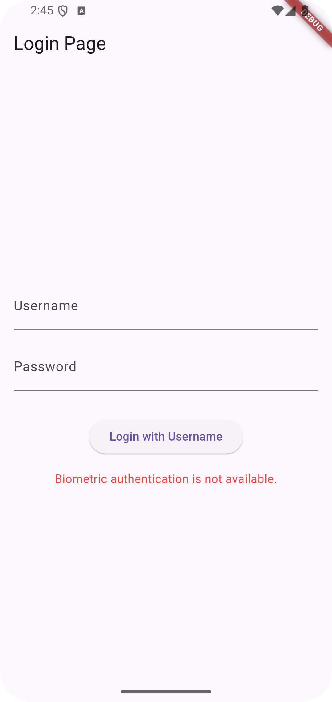
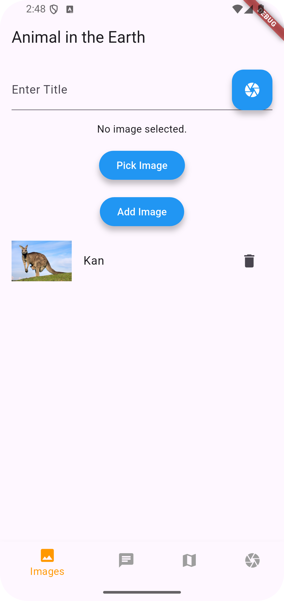
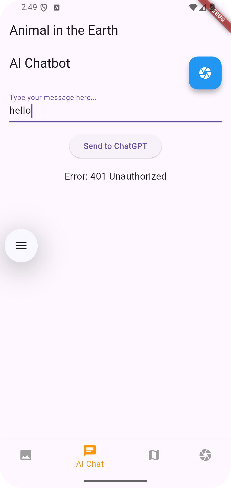
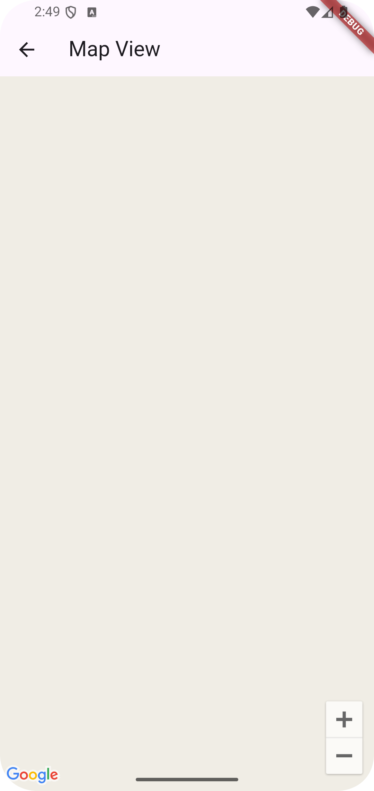
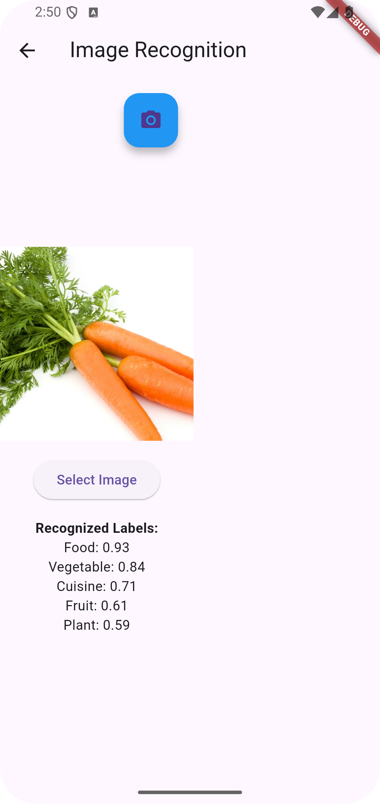

# another_flutterapp 🐾

A cross-platform Flutter app that helps users **save memories of animals** and **recognise different species** with on-device ML.  
Built as a personal learning project but ready to evolve into a full product.

---

## ✨ Key Features

| Feature | Description |
|---------|-------------|
| 🔐 **Secure login** | Email / third-party auth  |
| 💾 **Main dashboard** | Stores photos & notes of spotted animals, tracks progress |
| 🤖 **AI chatbot** | Powered by OpenAI Chat API for Q&A about animals |
| 🗺️ **Map view** | Shows saved sightings using Google Maps API |
| 📸 **Image recognition** | Google ML Kit classifies animals offline |

---

## 📸 Screenshots

### 1 · Login


### 2 · Dashboard (Save & view data)


### 3 · AI Chatbot


### 4 · Map


### 5 · Image Recognition


---

## 🛠️ Tech Stack

- **Flutter 3 / Dart 3** – single code-base for Android, iOS, Web & Desktop  
- **Firebase** – Auth & Cloud Firestore (planned)  
- **OpenAI Chat API** – conversational assistant  
- **Google ML Kit** – on-device image classification  
- **Google Maps SDK** – map and marker rendering  

---

## 🚀 Getting Started

```bash
# 1. Clone
git clone https://github.com/your-username/another_flutterapp.git
cd another_flutterapp

# 2. Install packages
flutter pub get

# 3. Run (pick one)
flutter run               # default device
flutter run -d chrome     # web
